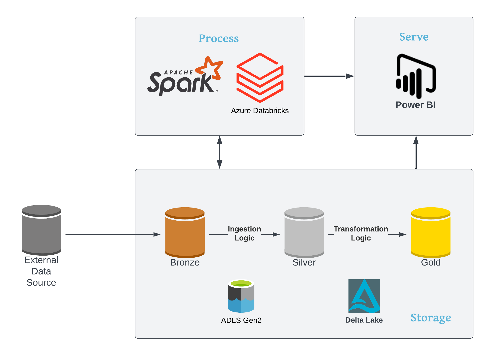

# End-to-End-Bike-Sharing-Project
Hello everyone,
I'm excited to share my latest End-to-End Bike Sharing Project developed using Azure Databricks, Azure Data Lake Gen 2, and Delta Lake with all of you. The main purpose of this project is to showcase my skills in data engineering and data analysis.

### Project Overview
The project focuses on bike sharing systems, which are automated bike rental systems with a global presence. These systems play a crucial role in traffic, environmental, and health matters. The dataset contains hourly data from various bike-sharing programs worldwide, consisting of over 500 thousand bicycles. For more detailed information on the dataset used for this project, please refer to the provided link.

### Project Requirements
#### Data Ingestion:
1. Ingest the raw data into the data lake.
2. Apply appropriate schema to the ingested data.
3. Enable SQL-based analysis on the ingested data.
#### Data Transformation:
1. Normalize the ingested data and create data model.
2. Enable SQL-based analysis on the transformed data.
#### Analysis:
1. Utilize Spark SQL to analyze the transformed data and gain insights.
#### Business Intelligence:
1. Develop a Power BI dashboard to track Key Performance Indicators (KPIs) of the bike sharing system.
### Tools Used
To fulfill the project requirements, I utilized Azure Databricks, Azure Data Lake Gen 2, Delta Lake, PySpark, Spark SQL, Power BI, VSCode, and Lucid Chart.

### Solution Architecture
The project follows the "Azure Databricks Modern Analytics Architecture" and employs a three-layer approach: bronze, silver, and gold. These layers represent different stages of data refinement, where the data's value increases as it progresses from bronze to gold.

|:--:|
|<b>Architecture - Fig.1</b>|

1. Bronze Layer: The bronze layer serves as the initial landing zone for raw and unprocessed data. It stores the ingested data in its original raw format.

|:--:|
|<b>Raw Data - Fig.2</b>|

2. Silver Layer: The silver layer acts as an intermediate stage where data undergoes cleaning, transformation, and structuring. It prepares the data for downstream analytics by performing deduplication, filtering, standardization, and enrichment. Data quality checks, schema validation, and integration processes ensure data consistency and reliability.

|:--:|
|<b>Processed Data - Fig.3</b>|

3. Gold Layer: The gold layer represents the final stage of data refinement. It contains a well-structured, clean, and validated dataset optimized for efficient querying and analysis. Further transformations, aggregations, joins, and optimizations are performed on the data to cater to specific analytical use cases.

|:--:|
|<b>Data Model- Fig.3</b>|

### Analysis using Spark SQL
One of the key highlights of this solution is the ability to analyze data in each layer using Spark SQL. This empowers users to leverage the power of Spark SQL in conjunction with PySpark for comprehensive data analysis. The "Analysis" folder provides all the Spark SQL queries performed on the transformed data.

### Project Outcome
The project culminates in a Power BI dashboard that utilizes data from the gold layer to track Key Performance Indicators (KPIs) of the bike sharing system.

